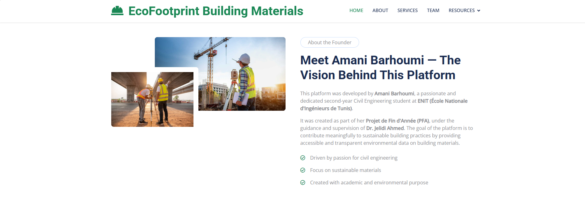
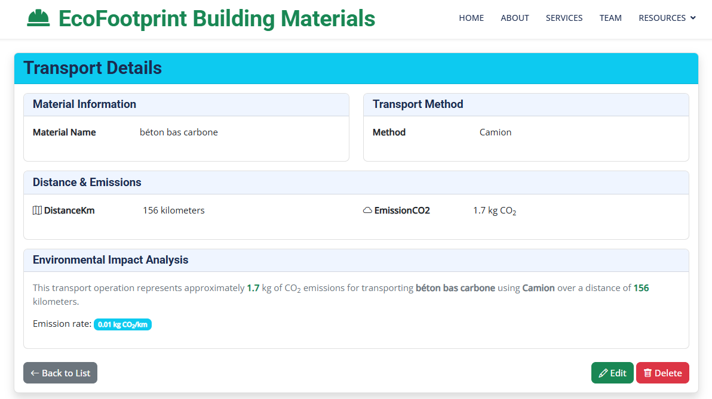
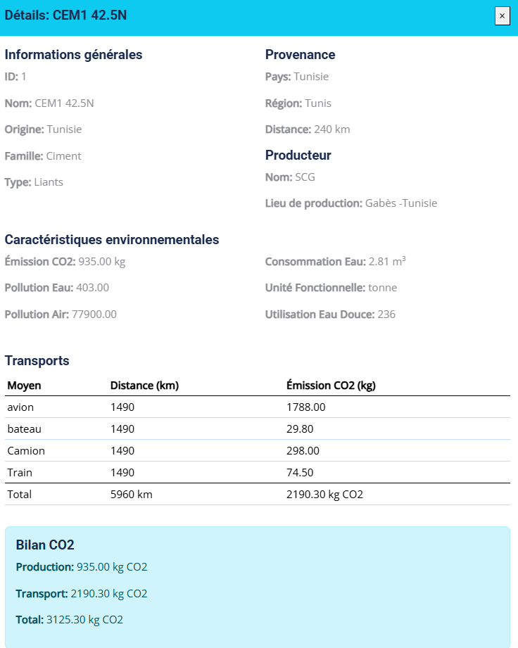
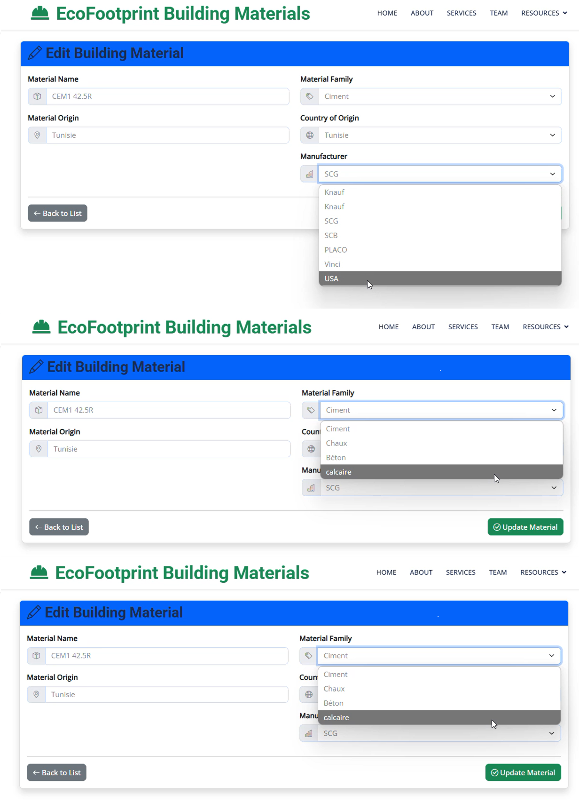
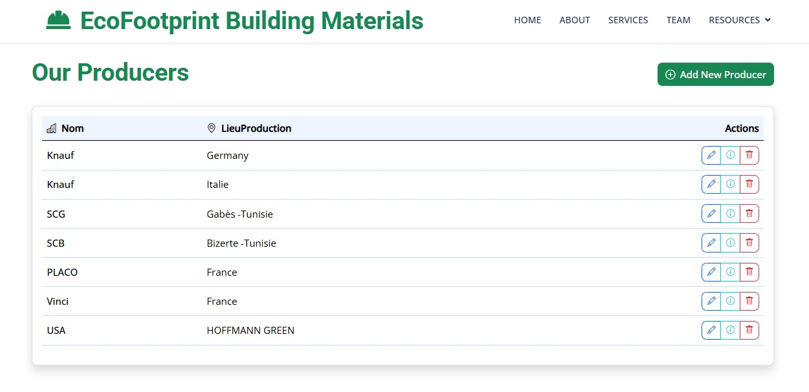
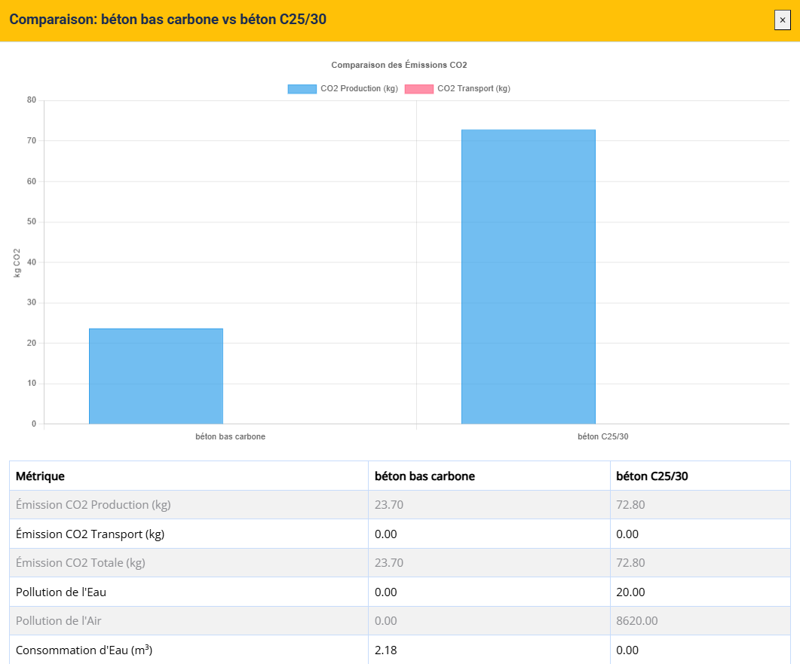

# Building Materials Management System

## Overview
The Building Materials Management System is a web application designed to manage and analyze data related to building materials, their environmental characteristics, transportation factors, and more. It provides a user-friendly interface for managing materials, producers, provenance, and environmental impact data.

## Features
- **Material Management**: Add, edit, and view details of various building materials.
- **Environmental Impact Analysis**: Analyze CO₂ emissions, water pollution, air pollution, and water consumption for materials.
- **Transportation Factors**: Manage transport modes and their associated environmental impact factors.
- **Provenance and Producers**: Track the origin and producers of materials.
- **User-Friendly Interface**: Intuitive design for easy navigation and data management.

## Screenshots
### Home Page


### Material Details


### Environmental Impact Analysis


### Add New Material


### Producer Management

### Statistics


## Technologies Used
- **ASP.NET Core**: Backend framework for building the web application.
- **Entity Framework Core**: ORM for database interactions.
- **Bootstrap**: Frontend framework for responsive design.
- **SQL Server**: Database for storing application data.

## Getting Started
1. Clone the repository:
   ```bash
   git clone <repository-url>
   ```
2. Open the solution file `building-materials.sln` in Visual Studio.
3. Update the database connection string in `appsettings.json`.
4. Run the application using Visual Studio or the .NET CLI:
   ```bash
   dotnet run
   ```
5. Access the application in your browser at `http://localhost:<port>`.

## License
This project is licensed under the MIT License. See the `LICENSE.txt` file for details.